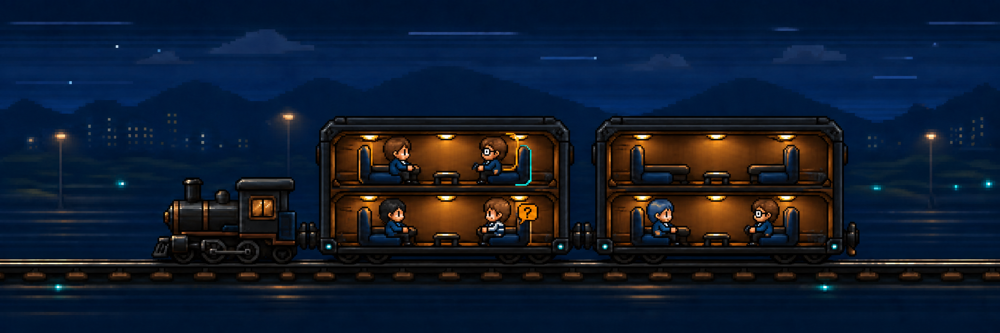

# Train Layout Retrospective

The train pane switcher was an experiment in making a group of live agent panes
feel like fellow travellers instead of rows in a status dashboard. The shipped
implementation has been removed. This note preserves the useful product idea,
the lessons from the failed execution, and the constraints for any future
attempt.

## Core concept

- A pane is represented by a passenger occupying a seat.
- Four visible panes fit in each double-decker carriage; empty seats make spare
  capacity legible.
- Pane activity should be glanceable through the passenger and seat treatment,
  without requiring the user to read a separate status row.
- The locomotive and carriages form a stable, selectable foreground. A moving
  background can suggest a shared journey, but must never interfere with pane
  selection or terminal input.
- The experience should be calm, compact, accessible, and subordinate to the
  terminal. It is a pane switcher first and ambient decoration second.

The strongest part of the idea was the direct spatial metaphor: agents are
passengers travelling together, and selecting a passenger selects that pane.
That concept does not require a simulated world.

## What was built

The experiment grew from a compact train-and-passenger selector into a
deterministic procedural journey with:

- a recyclable route-chunk engine and five parallax layers;
- forest, mountain, town, coast, and industrial region grammars;
- stations, bridges, tunnels, landmarks, transitions, and collision rules;
- day, sunset, and night palettes with separate emissive treatments;
- elapsed-time motion, reduced-motion behavior, and journey persistence;
- generated scenery catalogs, composition diagnostics, and extensive visual
  convergence tests.

At removal time the feature included a 4,425-line React module, a 3,514-line
scenery generator, 5,145 lines of CSS, a 5,936-line primary test file, and 127
runtime/source/reference image assets occupying roughly 22 MB. The surrounding
development evidence added another roughly 25 MB of contact sheets.

## Why it failed

- The pane-switching value was never strong enough to justify a miniature world
  simulation.
- Scenery generation, animation, set-piece choreography, persistence, and pane
  UI became tightly coupled. Small visual changes required coordinated changes
  across React, CSS, assets, geometry rules, and tests.
- The procedural scene repeatedly produced composition defects: stacked terrain
  bands, repeated silhouettes, inconsistent scale and grounding, monolithic
  stations, obscured set pieces, and weak regional identity.
- Test volume protected implementation detail and pixel geometry more than user
  value. It made the failed direction expensive to change without proving that
  the result was a better pane switcher.
- The moving scenery competed for attention with the terminal and turned an
  optional visual theme into one of the frontend's largest subsystems.
- Successive repair passes optimized local defects while increasing the sunk
  cost and architectural surface of the original idea.

## Constraints for a future attempt

Start from a clean implementation rather than restoring the removed code.

1. Prototype only the locomotive, carriages, passengers, and pane interactions.
   Do not build a route engine during validation.
2. Prove with real usage that selecting and reading pane state is at least as
   effective as the chip and office layouts.
3. Keep the complete prototype small enough to understand as one ordinary UI
   feature. Treat rapid growth in geometry rules or visual tests as a stop
   signal.
4. Prefer one restrained static or slowly translated background. No region
   grammar, collision system, journey persistence, or set-piece lifecycle until
   the basic selector has clearly succeeded.
5. Design reduced motion, compact screens, keyboard navigation, and minimum hit
   targets at the start.
6. Measure success by usefulness and calmness, not by the richness of the
   generated world.

## Historical recovery

Git remains the implementation archive. The last pre-removal implementation
commit touching `TrainLayout.tsx` was
`1ab494dbf19a41c399947d2f49a1b922fd208739` (2026-07-28). Use repository history
for code or asset archaeology; do not copy the old subsystem into a new attempt
by default.
